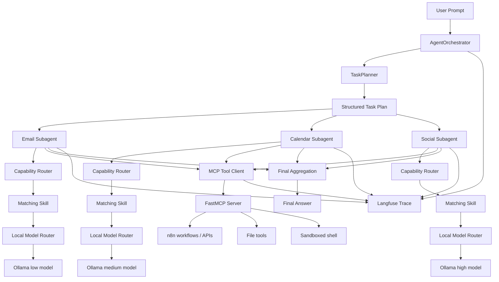

# ReAct AI Agent Orchestrator

Personal AI agent orchestrator built around local LLMs, ReAct loops, dynamic subagents, self-hosted MCP tools, and markdown Skills that improve from run experience.

The project is designed for local-first automation: Ollama handles model inference, FastMCP exposes executable tools and workflows, Skills provide reusable task procedures, Docker isolates risky execution, and Langfuse records the full agent trace.

## Stack

- Python
- Ollama
- FastMCP
- Markdown Skills
- Langfuse
- Docker
- n8n-compatible workflow hooks

## What It Does

A single user prompt is planned into smaller tasks, then executed by focused subagents running concurrently.

Each subagent follows this routing order:

```text
1. Check for a matching Skill
2. Use the Skill as the task procedure
3. Call MCP tools for execution when needed
4. If no Skill or MCP tool exists, mark the task unsupported
```

This keeps the agent grounded: Skills define how the agent should work, while MCP tools perform real actions such as email processing, calendar scheduling, file generation, shell execution, or n8n workflow calls.

## Architecture



## Core Concepts

### ReAct Agent Loop

Each subagent runs a Reasoning + Action loop:

```text
Thought is handled by the model context.
Action: {"tool":"tool_name","arguments":{},"reason":"why this tool is needed"}
Observation: tool result
Final: "task result"
```

The loop repeats until the subagent returns `Final` or reaches the configured step limit.

### Local Model Routing

The router maps task complexity to local Ollama models:

```text
low    -> small local model
medium -> balanced local model
high   -> strongest local model
```

This preserves a local-first design while still allowing different models to be used for different task difficulty levels.

### Skills

Skills are markdown procedures stored under `skills/`.

Current Skills:

```text
skills/
  task_planning/SKILL.md
  react_execution/SKILL.md
  email_reasoning/SKILL.md
  calendar_reasoning/SKILL.md
  social_content/SKILL.md
  error_recovery/SKILL.md
```

Skills do not duplicate MCP workflows. They teach the agent how to approach a task, choose fields, recover from errors, and decide when a tool call is needed.

### MCP Tools

MCP is the execution layer. The FastMCP server exposes tools such as:

```text
email_process
calendar_schedule
social_post
daily_summary
bash_execute
write_txt_file
write_markdown_file
write_csv_file
write_json_file
write_docx_file
```

These tools can trigger n8n workflows, call external APIs, write files, or run local commands inside a restricted workspace.

### Self-Evolving Skills

The agent does not blindly rewrite its own Skills. Instead, each run can produce a skill update proposal.

```text
1. Save run trace to memory/runs/
2. Reflect on successful and failed steps
3. Generate a JSON skill proposal
4. Save proposal to skills/proposals/
5. Apply only after review or approval
```

This gives the system a safe evolution path without corrupting core instructions. The proposal loop is planned as a follow-up phase after the initial SkillStore and capability router.

### Langfuse Observability

Langfuse is used to trace the full orchestration lifecycle:

```text
root prompt
planner call
skill selection
subagent execution
ReAct steps
model calls
MCP tool calls
final aggregation
skill evolution proposal
```

It does not require an agent framework; the custom Python loop can emit traces directly.

### Docker Sandbox

Risky tools such as shell execution and file writes should run through the MCP server inside Docker.

The MCP container can be restricted with:

```text
read-only filesystem
limited mounted workspace
no-new-privileges
dropped Linux capabilities
optional network isolation for local-only tools
```

For workflows that require n8n or external APIs, the automation MCP server can run with network access while local shell/file tools remain sandboxed separately.

## Example Flow

Prompt:

```text
Summarize unread emails and schedule follow-up reminders tomorrow at 10am.
```

Planner output:

```json
{
  "tasks": [
    {
      "agent_type": "email",
      "instruction": "Summarize unread emails and identify urgent follow-ups.",
      "complexity": "low"
    },
    {
      "agent_type": "calendar",
      "instruction": "Schedule follow-up reminders tomorrow at 10am.",
      "complexity": "medium"
    }
  ]
}
```

Execution:

```text
EmailSubAgent
  -> loads email_reasoning Skill
  -> calls MCP email_process
  -> returns email summary

CalendarSubAgent
  -> loads calendar_reasoning Skill
  -> calls MCP calendar_schedule
  -> returns scheduling result
```

Both subagents execute concurrently, then the orchestrator aggregates the final response.

## CLI Usage

Basic run:

```bash
python react_agent.py --prompt "Summarize unread emails and schedule follow-up tomorrow at 10am"
```

With local model routing and Skills:

```bash
python react_agent.py \
  --prompt "Summarize unread emails and schedule follow-up tomorrow at 10am" \
  --ollama-small-model llama3.2:3b \
  --ollama-medium-model llama3.1:8b \
  --ollama-large-model qwen2.5:14b \
  --ollama-base-url http://localhost:11434 \
  --skills-dir skills \
  --mcp-server mcp_server.py \
  --max-subagent-steps 6
```

Dockerized MCP server:

```bash
docker build -f Dockerfile.mcp -t react-mcp-server:latest .

python react_agent.py \
  --prompt "Generate a markdown report from my email summary" \
  --skills-dir skills \
  --mcp-command docker \
  --mcp-args run --rm -i react-mcp-server:latest
```

## Environment

```bash
OLLAMA_BASE_URL=http://localhost:11434
OLLAMA_SMALL_MODEL=llama3.2:3b
OLLAMA_MEDIUM_MODEL=llama3.1:8b
OLLAMA_LARGE_MODEL=qwen2.5:14b
SKILLS_DIR=skills
MCP_SERVER_PATH=mcp_server.py
N8N_WEBHOOK_BASE=https://your-n8n-domain/webhook
LANGFUSE_PUBLIC_KEY=
LANGFUSE_SECRET_KEY=
LANGFUSE_HOST=
```

## Repository Direction

The intended implementation path is:

```text
1. Local-only Ollama model routing
2. Markdown SkillStore and skill selection
3. Capability router with Skill-first, MCP-fallback behavior
4. Per-run memory traces
5. Skill proposal generation from run experience
6. Docker-restricted MCP execution
7. Langfuse tracing across the agent lifecycle
```

## Design Rule

```text
Skills decide how to work.
MCP performs actions.
Langfuse observes the run.
Docker contains risky execution.
```
