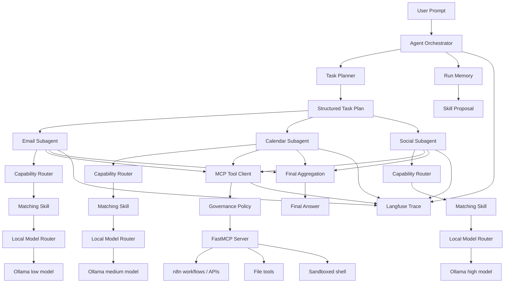

# ReAct AI Agent Orchestrator

Personal AI agent orchestrator built around local LLMs, ReAct loops, dynamic subagents, self-hosted MCP tools, and markdown Skills that improve from run experience.

The project is designed for local-first automation: Ollama handles model inference, FastMCP exposes executable tools and workflows, Skills provide reusable task procedures, Docker isolates risky execution, and Langfuse records the full agent trace.

## Stack

- Python
- Ollama
- FastMCP
- Markdown Skills
- Langfuse
- Docker
- n8n-compatible workflow hooks

## What It Does

A single user prompt is planned into smaller tasks, then executed by focused subagents running concurrently.

Each subagent follows this routing order:

```text
1. Check for a matching Skill
2. Use the Skill as the task procedure
3. Call MCP tools for execution when needed
4. If no Skill or MCP tool exists, mark the task unsupported
```

This keeps the agent grounded: Skills define how the agent should work, while MCP tools perform real actions such as email processing, calendar scheduling, file generation, shell execution, or n8n workflow calls.

## Features

- Local Ollama model routing for low, medium, and high complexity tasks.
- ReAct-style subagents that reason, choose an action, observe tool output, and return a final result.
- Concurrent task delegation so email, calendar, file, shell, and content workflows can run as separate focused subagents.
- Markdown Skills that describe task procedures, triggers, and allowed execution tools.
- Skill-first routing: the agent checks relevant Skills before falling back to raw MCP tool matching.
- Self-hosted FastMCP execution layer for n8n workflows, file generation, and sandboxed shell actions.
- Self-evolving Skills through run memory, local reflection, proposed updates, and user approval.
- Local JSON run memory that records prompts, planned tasks, selected Skills, tool calls, policy decisions, errors, and final answers.
- Optional Langfuse observability for tracing planner calls, subagent steps, model outputs, MCP calls, and Skill evolution.
- Local governance policy that can allow, block, or request approval before MCP tools execute.
- Docker-based MCP sandboxing with a restricted writable workspace, non-root execution, dropped capabilities, and a read-only container filesystem.

## Architecture



## Core Concepts

### ReAct Agent Loop

Each subagent runs a Reasoning + Action loop:

```text
Thought is handled by the model context.
Action: {"tool":"tool_name","arguments":{},"reason":"why this tool is needed"}
Observation: tool result
Final: "task result"
```

The loop repeats until the subagent returns `Final` or reaches the configured step limit. Each step is saved into the run trace with model output, parsed action, observation, errors, and recovery prompts.

### Local Model Routing

The router maps task complexity to local Ollama models:

```text
low    -> small local model
medium -> balanced local model
high   -> strongest local model
```

This preserves a local-first design while still allowing different models to be used for different task difficulty levels.

### Skills

Skills are markdown procedures stored under `skills/`.

Current Skills:

```text
skills/
  task_planning/SKILL.md
  react_execution/SKILL.md
  email_reasoning/SKILL.md
  calendar_reasoning/SKILL.md
  social_content/SKILL.md
  error_recovery/SKILL.md
  skill_evolution/SKILL.md
```

Skills do not duplicate MCP workflows. They teach the agent how to approach a task, choose fields, recover from errors, and decide when a tool call is needed.

Example Skill:

```markdown
---
name: email_reasoning
description: Decide how to process email automation requests before calling the email MCP workflow.
triggers: ["email", "emails", "inbox", "unread", "thread", "threads", "urgent", "follow-up", "followup"]
tools: ["email_process", "daily_summary"]
---

# Email Reasoning

1. Identify the requested email mode: summary, urgent, cleanup, or daily summary.
2. Preserve user constraints such as date, unread-only, sender, urgency, or follow-up intent.
3. Use `email_process` for targeted email operations.
```

How it is used:

```text
User prompt mentions unread emails
Skill routing matches email triggers
Email subagent receives email_reasoning in Relevant Skills
Only email_process and daily_summary are exposed for that routed task
Governance still checks the final MCP call before execution
```

### MCP Tools

MCP is the execution layer. The FastMCP server exposes tools such as:

```text
email_process
calendar_schedule
social_post
daily_summary
bash_execute
write_txt_file
write_markdown_file
write_csv_file
write_json_file
write_docx_file
```

These tools can trigger n8n workflows, call external APIs, write files, or run local commands inside a restricted workspace.

### Governance Policy

Governance is local policy enforcement before MCP execution. It decides whether a proposed tool call is allowed, denied, or requires user approval.

```text
Model proposes MCP tool call
Governance policy checks tool + arguments
allow / approval_required / deny
Only allowed calls reach MCP
```

The default policy is stored in `governance_policy.json`:

```text
email_process summary/urgent -> allow
calendar_schedule -> approval required
social_post -> approval required
bash_execute -> approval required unless denied
file writes -> allowed only inside configured workspace/output dirs
dangerous shell patterns -> deny
unknown tools -> deny
```

Every policy decision is saved into local run memory and emitted to Langfuse when tracing is enabled.

Example blocked trace fragment:

```json
{
  "action": {
    "tool": "bash_execute",
    "arguments": {
      "command": "rm -rf workspace"
    },
    "reason": "clean old files"
  },
  "policy_decision": "deny",
  "policy_reason": "Command contains denied pattern: rm -rf",
  "approval_status": "not_required",
  "blocked_tool_call": {
    "tool": "bash_execute",
    "reason": "Command contains denied pattern: rm -rf"
  }
}
```

### Run Memory

Each CLI run saves one structured JSON trace under `memory/runs/`.

The trace includes:

```text
prompt
model config
available MCP tools
planned tasks
selected skills
available tools per subagent
policy decisions and approval status
subagent statuses
ReAct step history
unsupported tasks
final answer
skill proposal path, if one was generated
```

### Self-Evolving Skills

The agent does not blindly rewrite its own Skills. Instead, each run can produce a skill update proposal and ask for approval immediately.

```text
1. Save run trace to memory/runs/
2. Reflect on successful and failed steps
3. Generate a JSON skill proposal
4. Show the proposal in the CLI
5. Ask whether to apply it
6. If approved, update or create the Skill
7. If rejected, delete the proposal
```

Unsupported tasks automatically create `missing_capability` proposals. Normal runs may create `skill_update` proposals when the local model finds reusable learning in the trace. Approved `skill_update` proposals append to `## Learned Updates` in the target Skill. Approved `missing_capability` proposals create a new `skills/<capability>/SKILL.md` stub. Rejected proposals are removed instead of accumulating.

Example proposal:

```json
{
  "type": "missing_capability",
  "skill": "flight",
  "reason": "User requested flight booking, but no matching Skill or MCP tool exists.",
  "suggested_change": "Add a flight planning Skill and MCP coverage for searching flights before booking.",
  "source_run": "memory/runs/run_20260815T061500000000Z.json",
  "status": "proposed"
}
```

Approval behavior:

```text
Apply this Skill change now? [y/N]:
y -> create or update the target SKILL.md
n -> delete the proposal JSON
EOF/no input -> delete the proposal JSON
```

### Langfuse Observability

Langfuse is optional and observes the custom Python loop directly. It does not require LangChain, CrewAI, OpenAI Agents SDK, or any other agent framework.

When `LANGFUSE_PUBLIC_KEY` and `LANGFUSE_SECRET_KEY` are configured, the agent traces the full orchestration lifecycle:

```text
root prompt
planner call
skill selection
subagent execution
ReAct steps
model calls
MCP tool calls
final aggregation
skill evolution proposal
```

If Langfuse is not configured, the agent still runs normally and saves local traces under `memory/runs/`.

### Docker Sandbox

Risky tools such as shell execution and file writes should run through the MCP server inside Docker. The MCP server also enforces `MCP_WORKSPACE_DIR`, so file writes and shell working directories cannot escape the mounted workspace.

The MCP container can be restricted with:

```text
read-only filesystem
limited mounted workspace
no-new-privileges
dropped Linux capabilities
non-root user
optional network isolation for local-only tools
```

For workflows that require n8n or external APIs, the automation MCP server can run with network access while local shell/file tools remain sandboxed separately.

## Example Flow

Prompt:

```text
Summarize unread emails and schedule follow-up reminders tomorrow at 10am.
```

Planner output:

```json
{
  "tasks": [
    {
      "agent_type": "email",
      "instruction": "Summarize unread emails and identify urgent follow-ups.",
      "complexity": "low"
    },
    {
      "agent_type": "calendar",
      "instruction": "Schedule follow-up reminders tomorrow at 10am.",
      "complexity": "medium"
    }
  ]
}
```

Execution:

```text
EmailSubAgent
  -> loads email_reasoning Skill
  -> calls MCP email_process
  -> returns email summary

CalendarSubAgent
  -> loads calendar_reasoning Skill
  -> calls MCP calendar_schedule
  -> returns scheduling result
```

Both subagents execute concurrently, then the orchestrator aggregates the final response, saves run memory, and may ask for approval to apply a Skill proposal.

## Demo Scenarios

### Skill-First Email + Calendar Workflow

```bash
python react_agent.py \
  --prompt "Summarize unread emails and schedule follow-up reminders tomorrow at 10am" \
  --skills-dir skills \
  --memory-dir memory
```

Expected route:

```text
TaskPlanner -> email task + calendar task
email task -> email_reasoning Skill -> email_process MCP tool
calendar task -> calendar_reasoning Skill -> calendar_schedule MCP tool
governance -> email summary allowed, calendar scheduling asks approval
memory -> saves selected Skills, tool calls, policy decisions, final answer
Langfuse -> records the same lifecycle when configured
```

Example subagent result shape:

```json
{
  "agent_type": "calendar",
  "instruction": "Schedule follow-up reminders tomorrow at 10am.",
  "complexity": "medium",
  "selected_skills": ["calendar_reasoning"],
  "available_tools": ["calendar_schedule"],
  "status": "completed",
  "result": "Follow-up reminder scheduled for tomorrow at 10am."
}
```

### Unsupported Capability Becomes a Skill Proposal

```bash
python react_agent.py \
  --prompt "Book the cheapest flight to Tokyo next Friday" \
  --skills-dir skills \
  --memory-dir memory
```

Expected route:

```text
No matching flight Skill
No matching MCP flight booking tool
subagent returns unsupported
memory trace is saved
SkillEvolution creates missing_capability proposal
CLI asks whether to create/update the Skill
user approves -> new Skill stub is created
user rejects -> proposal JSON is deleted
```

### Governance Blocks a Risky Shell Action

If a subagent tries:

```text
Action: {"tool":"bash_execute","arguments":{"command":"rm -rf workspace"},"reason":"clean old files"}
```

Expected result:

```text
Governance policy detects denied command pattern
MCP tool is not called
subagent returns failed blocked result
memory trace includes blocked_tool_call
Langfuse records governance.tool_deny when configured
```

## CLI Usage

Basic run:

```bash
python react_agent.py --prompt "Summarize unread emails and schedule follow-up tomorrow at 10am"
```

With local model routing, Skills, and memory:

```bash
python react_agent.py \
  --prompt "Summarize unread emails and schedule follow-up tomorrow at 10am" \
  --ollama-small-model llama3.2:3b \
  --ollama-medium-model llama3.1:8b \
  --ollama-large-model qwen2.5:14b \
  --ollama-base-url http://localhost:11434 \
  --skills-dir skills \
  --memory-dir memory \
  --governance-policy governance_policy.json \
  --mcp-server mcp_server.py \
  --max-subagent-steps 6
```

With optional self-hosted Langfuse:

```bash
LANGFUSE_PUBLIC_KEY=pk-lf-...
LANGFUSE_SECRET_KEY=sk-lf-...
LANGFUSE_HOST=http://localhost:3000

python react_agent.py \
  --prompt "Summarize unread emails" \
  --skills-dir skills \
  --memory-dir memory
```

Disable proposal generation while still saving run memory:

```bash
python react_agent.py \
  --prompt "Summarize unread emails" \
  --disable-skill-evolution
```

Disable Langfuse while keeping local run memory:

```bash
python react_agent.py \
  --prompt "Summarize unread emails" \
  --disable-langfuse
```

Disable governance for legacy behavior:

```bash
python react_agent.py \
  --prompt "Summarize unread emails" \
  --disable-governance
```

Auto-approve only tools listed in `safe_auto_approve_tools`:

```bash
python react_agent.py \
  --prompt "Write a local report" \
  --auto-approve-safe-tools
```

Dockerized MCP server:

```bash
docker build -f Dockerfile.mcp -t react-mcp-server:latest .

python react_agent.py \
  --prompt "Generate a markdown report from my email summary" \
  --skills-dir skills \
  --memory-dir memory \
  --mcp-command docker \
  --mcp-args run --rm -i \
    --read-only \
    --security-opt no-new-privileges:true \
    --cap-drop ALL \
    --tmpfs /tmp \
    -e MCP_WORKSPACE_DIR=/workspace \
    -e N8N_WEBHOOK_BASE="$N8N_WEBHOOK_BASE" \
    -v "$PWD/workspace:/workspace:rw" \
    react-mcp-server:latest
```
